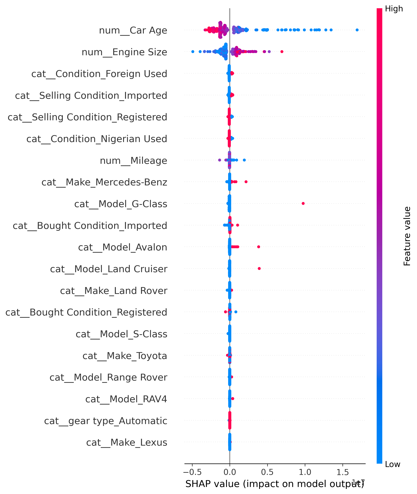

# 🚗 DriveValue Nigeria - Nigerian Car Price Predictor

This is a machine learning web application that predicts the market price of used cars in Nigeria. Users can input car details and instantly receive an estimated price in Naira.

The model is built using a Random Forest Regressor and includes SHAP (SHapley Additive exPlanations) for model explainability, helping users understand which features influence the predicted price.

---
### Live App Link -> https://driveng-2hhrwddtcvqrhwagpzpejz.streamlit.app/#estimated-car-price-predictor
---
---
## Demo Video

[](https://youtu.be/cWBAOD7HxV0)
---
## 📌 Project Overview

DriveValue Nigeria helps users:
- Estimate used car prices in Nigeria
- Understand key factors affecting car prices
- Get instant predictions using a trained ML model

---

## 📊 Features

- User-friendly web interface built with Streamlit
- Real-time car price prediction
- Machine learning model trained on Nigerian car data
- Model explainability using SHAP
- Handles categorical and numerical car features

---

## 🧠 Machine Model Used
- Random Forest Regressor (Best Performing Model)✔️
  
---

## 🔑 Key findings
- A tuned Randon Forest outperforned a Linear Regression baseline, achieving an MAE of N[1.27]M and an R2 of [0.537] on the held-out test set of predicted price
- SHAP analysis identified [top feature e.g. year], [2nd feature e.g. mileage_kn], and [3rd feature e.g. brand] as the strongest drivers
- Never cars and lover mileage consistently oushed predictions hioher, contirmind real-world intuition about the Nigerian used car market
---

## 🧠 Machine Learning Model

- Algorithm: Random Forest Regressor
- Explainability: SHAP (SHapley Additive exPlanations)
- Task Type: Regression
- Target Variable: Car price (Naira)

---

## 📝 Project Workflow

### 1. Data Collection
Collected dataset of used cars in Nigeria.

### 2. Data Cleaning
- Removed missing and duplicate values
- Handled incorrect data types
- Processed inconsistent entries

### 3. Feature Engineering
- Encoded categorical variables using one-hot encoding
- Selected important features for prediction

### 4. Model Training
- Trained multiple models
- Selected Random Forest as best performer

### 5. Model Evaluation
- Evaluated using MAE, RMSE, and R² score

### 6. Model Explainability
- Used SHAP to interpret feature importance
  
## SHAP Summary Plot


---

## Installation

### Clone the repository 
```
git clone (https://github.com/olamiderokeeb02-sketch/car-price-predictor.git)
```
cd drivevalue-nigeria
### Move into the project directory
```
cd your-repository-name
```
### Install required packages
```
pip install -r requirements.txt
```
## Running the App

### Run the Streamlit app locally
```
streamlit run app.py
```
#### Then open the generated local URL in your browser.

## Future Improvements

- Improve model accuracy
- Add image-based car analysis
- Integrate live car market APIs
- Add user authentication
- Deploy with Docker
- Add advanced visualizations

  ---

  ## Author
  
  Developed by Rokeeb Adedapo.
